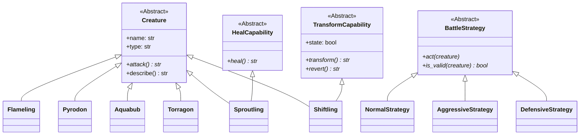

# DataDeck: Abstract Card Architecture 🃏

Este proyecto es una implementación avanzada de un sistema de cartas de criaturas utilizando Python 3.10+. El objetivo principal es demostrar el uso de **patrones de diseño de software**, **clases abstractas** y **tipado estricto**.

---

## 🏗️ Arquitectura y Patrones de Diseño

El proyecto se divide en tres fases evolutivas, cada una aplicando un concepto de ingeniería de software diferente:

### 1. Abstract Factory (Ejercicio 0)
Se utiliza para crear familias de objetos relacionados sin especificar sus clases concretas.
- **CreatureFactory**: Clase base abstracta.
- **FlameFactory** y **AquaFactory**: Crean versiones "base" y "evolucionadas" de criaturas de fuego y agua respectivamente.

### 2. Capabilities & Mixins (Ejercicio 1)
En lugar de crear una jerarquía de herencia profunda y rígida, utilizamos **Capacidades** (Interfaces/Mixins) para añadir funcionalidades específicas.
- **HealCapability**: Permite a una criatura curarse.
- **TransformCapability**: Permite a una criatura cambiar de estado (forma) y potenciar su ataque.
- Esto permite que una criatura sea de tipo "Hierba" y "Curadora" simultáneamente mediante herencia múltiple.

### 3. Strategy Pattern (Ejercicio 2)
Permite definir una familia de algoritmos de batalla, encapsular cada uno y hacerlos intercambiables.
- **BattleStrategy**: Define cómo actúa una criatura en combate.
- **Normal**, **Aggressive**, **Defensive**: Diferentes comportamientos que validan si la criatura posee las capacidades necesarias antes de actuar.

---

## 📊 Esquema de Relaciones (Jerarquía de Clases)



---

## 🚀 Cómo ejecutar el proyecto

Para facilitar la evaluación, se incluyen tres scripts principales que prueban cada fase del proyecto:

1. **Prueba de Factorías (ex0):**
   ```bash
   python3 battle.py
   ```

2. **Prueba de Capacidades (ex1):**
   ```bash
   python3 capacitor.py
   ```

3. **Prueba de Torneo y Estrategias (ex2):**
   ```bash
   python3 tournament.py
   ```

---

## 🛠️ Calidad del Código

- **Linting:** Cumple al 100% con `flake8` (PEP 8).
- **Tipado:** Validado con `mypy --strict` para garantizar seguridad de tipos en todo el código.
- **Versión:** Compatible con Python 3.10 o superior.

---

*Desarrollado como parte del Cursus de 42.*
