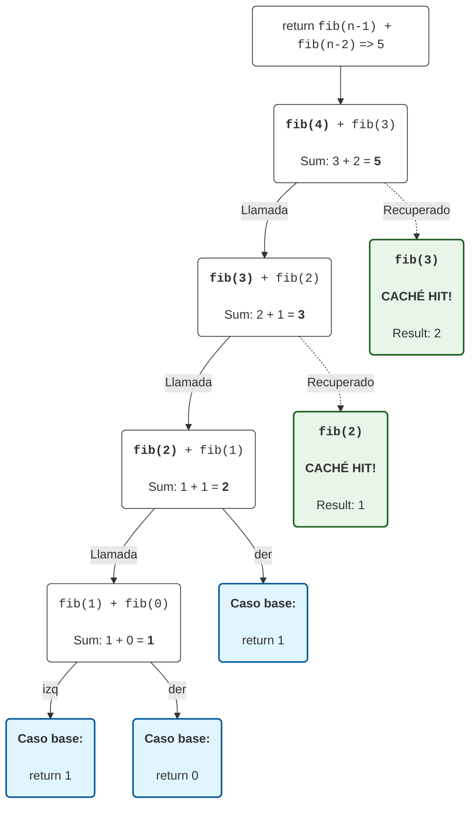
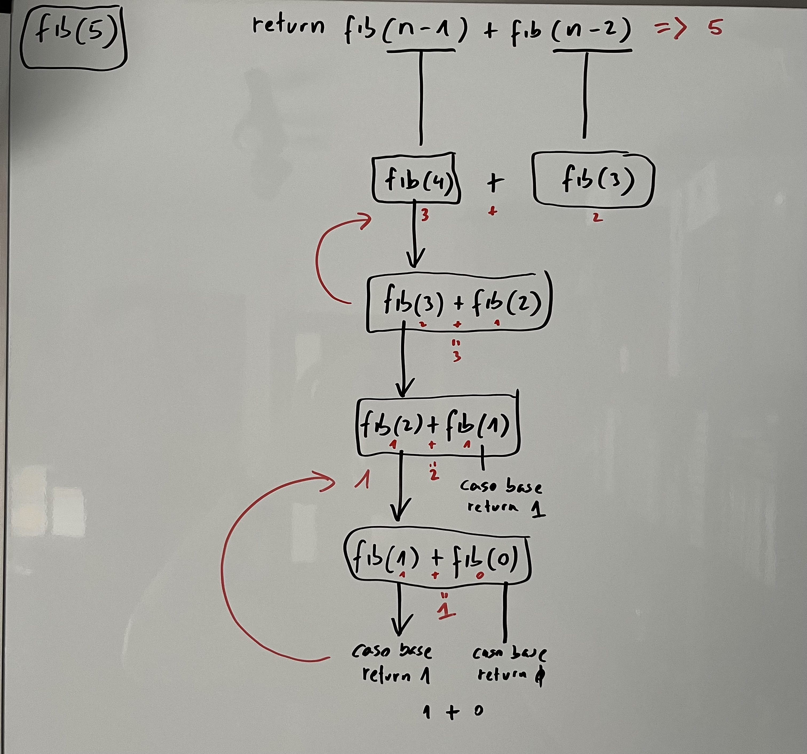

## Esquema función recursiva fibonacci:

## Esquema en formato ASCII:
```text
Llamada inicial: fib(5)
│
├── [Baja por la izquierda]
│   fib(4)
│   ├── fib(3)
│   │   ├── fib(2)
│   │   │   ├── fib(1) ---> (Caso base: retorna 1)
│   │   │   └── fib(0) ---> (Caso base: retorna 0)
│   │   │
│   │   └── fib(1) ---> [¡CACHÉ HIT! Recupera 1 instantáneamente]
│   │
│   └── fib(2) -------> [¡CACHÉ HIT! Recupera 1 instantáneamente]
│
└── [Sube y mira a la derecha]
    fib(3) -----------> [¡CACHÉ HIT! Recupera 2 instantáneamente]


* Resultado final: 5
```
## Esquema original en pizarra:

